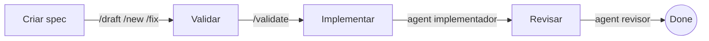
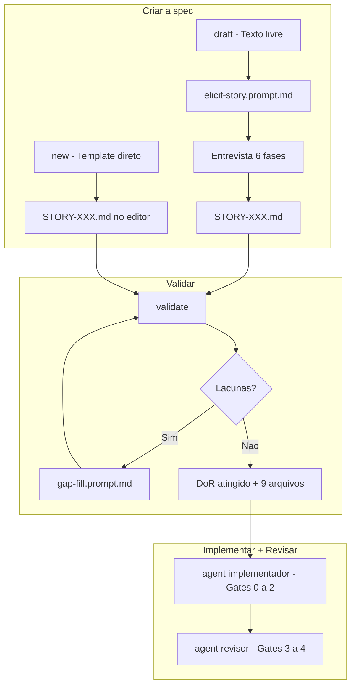
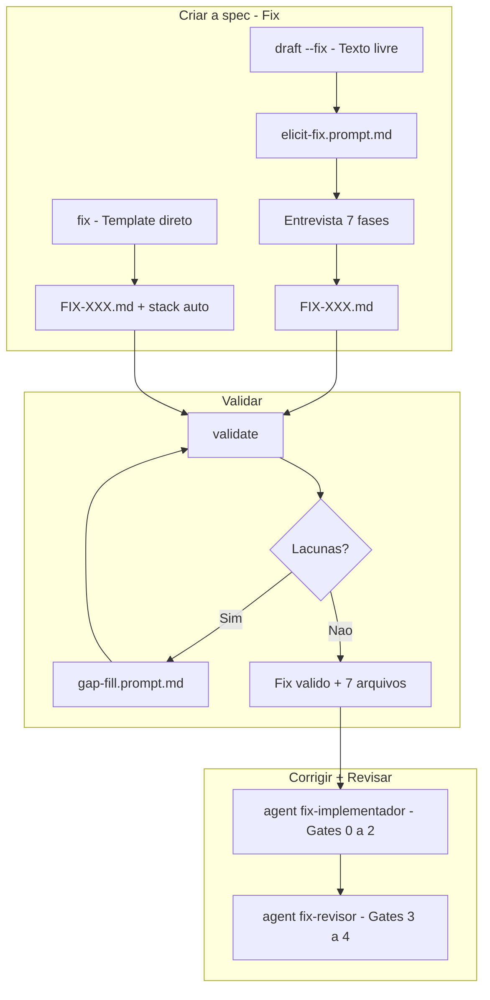
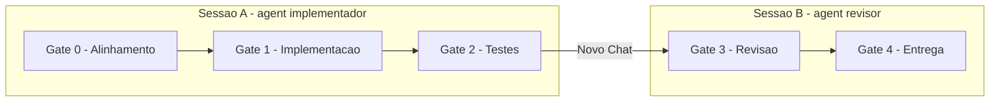
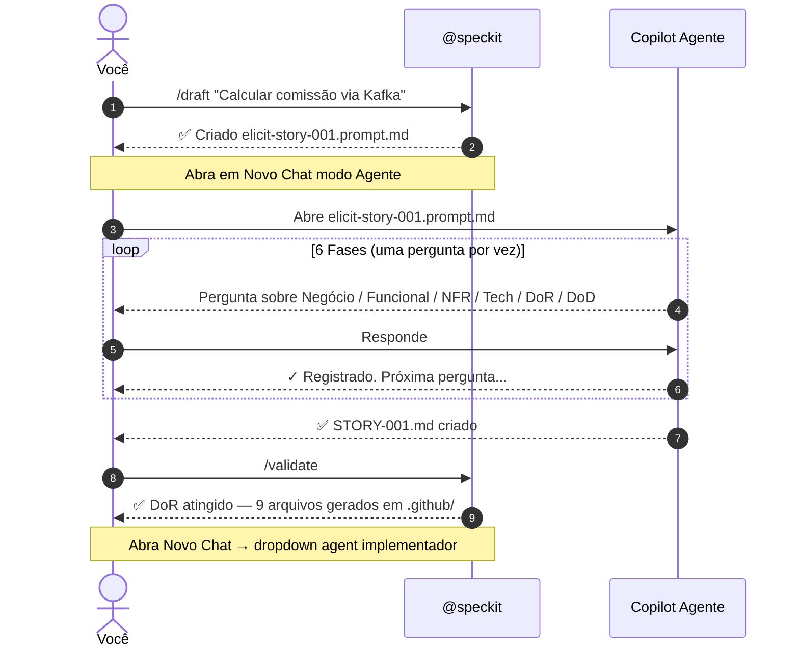
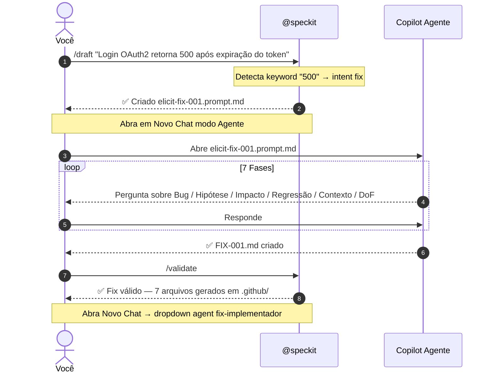
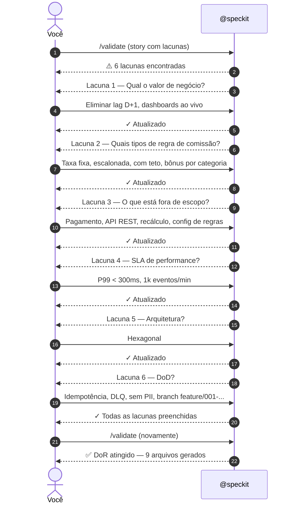
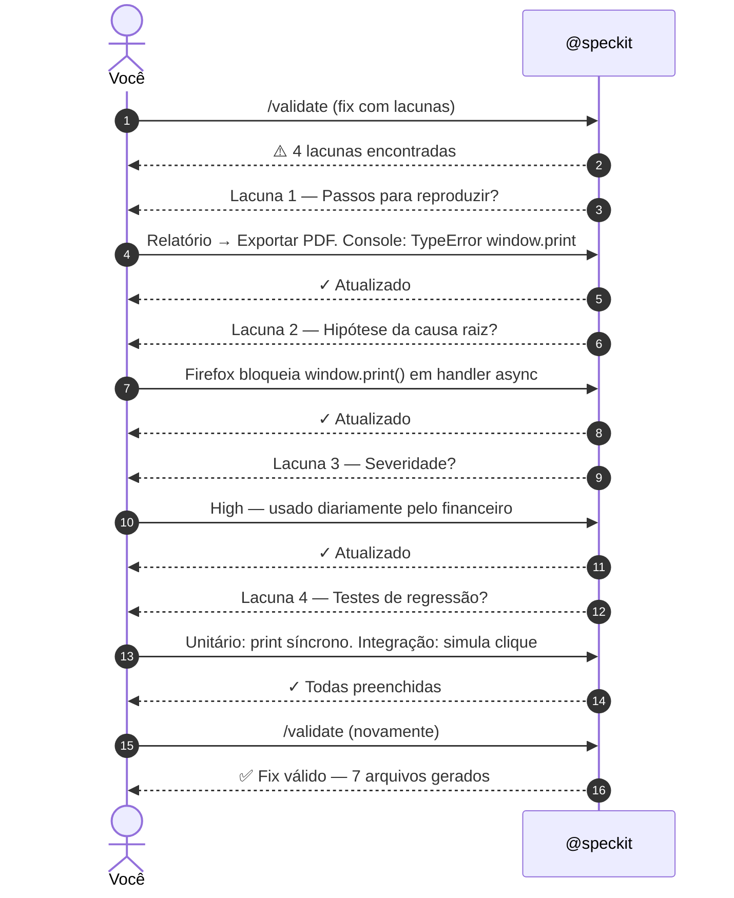

# SpecKit — Spec Driven Development

Plugin para VS Code que implementa o fluxo de **Spec Driven Development (SDD)**: você define uma História estruturada (nova feature) ou um Fix estruturado (correção de bug) antes de escrever código, e o plugin gera automaticamente os arquivos de configuração do GitHub Copilot que "primam" a sessão com todo o contexto do projeto.

O Copilot passa a conhecer o requisito de negócio, critérios de aceite, restrições não-funcionais, stack técnica, padrão arquitetural, regras de teste, convenções de versionamento, padrões de segurança, observabilidade e resiliência — antes de qualquer conversa começar.

---

## Guia de leitura

| Ordem | Seção                         | Quando ler                                   |
| ----- | ----------------------------- | -------------------------------------------- |
| 1     | **Como usar**                 | Fluxo essencial de ponta a ponta             |
| 2     | **Comandos**                  | Referência objetiva de cada comando          |
| 3     | **Paleta de comandos**        | Atalhos via `Ctrl+Shift+P`                   |
| 4     | **Configuração do workspace** | Defaults, detecção de stack, backup, logging |
| 5     | **Arquivos gerados**          | O que o plugin cria e para que serve         |
| 6     | **Gates de implementação**    | Como os agents conduzem a implementação      |
| 7     | **Exemplos práticos**         | Cenários completos (Story e Fix)             |

**Resumo do fluxo em 4 passos:**



> **Criar** e **validar** acontecem no chat `@speckit`. **Implementar** e **revisar** acontecem em sessões separadas do Copilot Chat, selecionando os agents no dropdown.

---

## Pré-requisitos

- VS Code `^1.93.0`
- Extensão **GitHub Copilot Chat** instalada e ativa

---

## Instalação

1. Faça o download do arquivo `.vsix` mais recente
2. No VS Code, abra a paleta de comandos (`Ctrl+Shift+P`)
3. Execute **"Extensions: Install from VSIX..."**
4. Selecione o arquivo `.vsix`

---

## Como usar

O SpecKit expõe um **Chat Participant** chamado `@speckit`. Todo o fluxo acontece no Copilot Chat.

> O participant é marcado como **sticky** — uma vez invocado, ele permanece selecionado até você trocar de participant. Não é necessário digitar `@speckit` em cada mensagem.

### Ponto de entrada: estruturado ou por texto livre

| Modo                | Comando                       | Quando usar                                                            |
| ------------------- | ----------------------------- | ---------------------------------------------------------------------- |
| **Texto livre**     | `@speckit /draft <descrição>` | Ideia ainda informal, não sabe os campos obrigatórios, quer ser guiado |
| **Template direto** | `@speckit /new` ou `/fix`     | Já conhece a estrutura e quer preencher diretamente                    |

Ambos os caminhos convergem para o mesmo `.speckit/STORY-XXX.md` ou `FIX-XXX.md` e seguem o mesmo fluxo de validação e implementação.

### Fluxo — Nova Feature (História)



### Fluxo — Correção de Bug (Fix)



---

## Comandos

### `@speckit /draft`

Converte texto livre em um prompt de elicitação que guia o Copilot a entrevistar você e montar a spec completa — Story ou Fix — sem que você precise conhecer os campos obrigatórios de antemão.

```
@speckit /draft <descrição livre>
```

**Detecção automática de intent:**

| Input                                                                     | Intent detectado                   | Arquivo gerado                             |
| ------------------------------------------------------------------------- | ---------------------------------- | ------------------------------------------ |
| `@speckit /draft Quero calcular comissão de vendedores via Kafka`         | story                              | `.speckit/elicit-story-{nextId}.prompt.md` |
| `@speckit /draft Login retorna 500 após expiração do token --fix`         | fix (flag `--fix`)                 | `.speckit/elicit-fix-{nextId}.prompt.md`   |
| `@speckit /draft O botão de exportar não funciona no Firefox`             | fix (keyword `não funciona`)       | `.speckit/elicit-fix-{nextId}.prompt.md`   |
| `@speckit /draft Crash ao abrir o modal de pagamento`                     | fix (keyword `crash`)              | `.speckit/elicit-fix-{nextId}.prompt.md`   |
| `@speckit /draft Migrar módulo de pagamento para hexagonal --refactoring` | refactoring (flag `--refactoring`) | `.speckit/elicit-story-{nextId}.prompt.md` |
| `@speckit /draft Avaliar viabilidade de SSR com Next.js --spike`          | spike (flag `--spike`)             | `.speckit/elicit-story-{nextId}.prompt.md` |

**Flags explícitas:**

| Flag            | Intent      | Aliases      |
| --------------- | ----------- | ------------ |
| `--fix`         | fix         | `--bug`      |
| `--refactoring` | refactoring | `--refactor` |
| `--spike`       | spike       | `--poc`      |

> Flags `--refactoring` e `--spike` geram um `elicit-story-{id}.prompt.md` com `type: refactoring` ou `type: spike` no metadata da spec. A entrevista é a mesma de story, mas o agente adapta o foco (refactoring → escopo cirúrgico; spike → viabilidade e aprendizado).

**Keywords que ativam intent fix (detecção automática, sem flag):** `bug`, `erro`, `error`, `falha`, `falhou`, `quebrado`, `broke`, `broken`, `crash`, `regressão`, `regression`, `corrigir`, `correção`, `não funciona`.

**Após a geração:** o SpecKit cria o arquivo de elicitação, abre no editor e instrui a iniciar um **Novo Chat em modo Agente** para conduzir a entrevista estruturada.

<details>
<summary><strong>Fases da entrevista — Story (6 fases)</strong></summary>

| Fase | Tema                    | Campos elicitados                                                                                                                  |
| ---- | ----------------------- | ---------------------------------------------------------------------------------------------------------------------------------- |
| 1    | Requisito de negócio    | Problema + urgência, valor de negócio + KPI candidato, stakeholders                                                                |
| 2    | Especificação funcional | User stories, critérios de aceite (quadrante: happy path · limites · rejeição · idempotência), fora de escopo derivado do contexto |
| 3    | NFRs                    | Performance (P99 com isenção para async), segurança, escalabilidade como código + recomendações de infra, disponibilidade          |
| 4    | Especificação técnica   | Linguagem, framework, arquitetura (sempre pergunta, sugere mas não presume), target, banco, infra                                  |
| 5    | Dependências, DoR e DoD | DoR com critérios AI-verificáveis separados dos de ação humana, DoD contextual (Kafka → DLQ rate, frontend → WCAG 2.1)             |
| 6    | Montagem final          | Salva `.speckit/STORY-XXX.md`, confirma criação                                                                                    |

</details>

<details>
<summary><strong>Fases da entrevista — Fix (7 fases)</strong></summary>

| Fase | Tema                   | Campos elicitados                                                                                                            |
| ---- | ---------------------- | ---------------------------------------------------------------------------------------------------------------------------- |
| 1    | Bug description        | Sintomas, primeira ocorrência, passos para reproduzir, ambiente, workaround, frequência, urgência — título proposto no final |
| 2    | Hipótese               | Pergunta aberta — extrai `hypothesis`, `suspectedFiles`, `suspectedComponents`                                               |
| 3    | Impacto                | Severidade cruzada com workaround, volume de usuários afetados, risco de regressão com nível e razão                         |
| 4    | Prevenção de regressão | Testes a adicionar                                                                                                           |
| 5    | Contexto técnico       | Sinaliza ativamente: Redis/TTL/cache miss, load balancer, config env, version flags                                          |
| 6    | DoF                    | Critérios de Definition of Fixed + adições contextuais                                                                       |
| 7    | Montagem final         | Salva `.speckit/FIX-XXX.md`, confirma criação                                                                                |

</details>

> **Regras do agente:** UMA pergunta por vez. Nunca inventa ou assume resposta. Resumo e confirmação ao final de cada fase. "Não sei" ≠ "N/A".

---

### `@speckit /new`

Cria o arquivo `.speckit/STORY-XXX.md` (numeração automática) e abre no editor.

| Seção                       | O que preencher                                                      |
| --------------------------- | -------------------------------------------------------------------- |
| Requisito de Negócio        | Problema, valor de negócio, stakeholders                             |
| Especificação Funcional     | User stories, critérios de aceite, fora de escopo                    |
| Especificação Não-Funcional | Performance, segurança, escalabilidade, usabilidade, disponibilidade |
| Especificação Técnica       | Linguagem, framework, arquitetura, target, banco, infra              |
| DoR                         | Marcar com `[x]` os critérios já atendidos                           |
| DoD                         | Critérios de conclusão                                               |

<details>
<summary><strong>Valores suportados</strong></summary>

| Campo       | Valores                                                               |
| ----------- | --------------------------------------------------------------------- |
| Linguagem   | `typescript` · `javascript` · `java` · `csharp` · `python`            |
| Framework   | `dotnet` · `springboot` · `angular` · `react` · `fastapi` · `other`   |
| Arquitetura | `hexagonal` · `layered` · `microservices` · `monolith` · `serverless` |
| Target      | `backend` · `frontend` · `bff` · `script` · `library`                 |

</details>

<details>
<summary><strong>Metadata da spec (campos automáticos)</strong></summary>

Cada spec contém um bloco `<!-- metadata -->` no markdown com campos gerenciados automaticamente:

| Campo          | Valores                                                              | Descrição                                                                  |
| -------------- | -------------------------------------------------------------------- | -------------------------------------------------------------------------- |
| `type`         | `story` · `refactoring` · `spike`                                    | Tipo da spec (story default, ou via `--refactoring`/`--spike` no `/draft`) |
| `status`       | `open` · `in-progress` · `review` · `blocked` · `done` · `cancelled` | Ciclo de vida da spec                                                      |
| `gate`         | `0` · `1` · `2` · `3` · `4`                                          | Gate atual de implementação                                                |
| `projectStage` | `greenfield` · `brownfield`                                          | Maturidade do projeto (afeta profundidade das instruções)                  |

> `type`, `status` e `gate` são usados pelo `/status` para exibir o progresso. O `projectStage` influencia o nível de detalhe dos skills gerados (greenfield → mais guardrails).

</details>

> **NFRs de performance** são opcionais — quando não preenchidos, o plugin aplica baseline (`P99 < 500ms` / `99,9%`) em todos os arquivos dependentes.

---

### `@speckit /fix`

Cria o arquivo `.speckit/FIX-XXX.md` (numeração automática) e abre no editor.

| Seção                 | O que preencher                                                                            |
| --------------------- | ------------------------------------------------------------------------------------------ |
| Bug Description       | Título, sintomas, passos para reproduzir, ambiente, frequência                             |
| Root Cause Hypothesis | Hipótese da causa raiz, arquivos/componentes suspeitos                                     |
| Impact Assessment     | Severidade (`critical` · `high` · `medium` · `low`), usuários afetados, risco de regressão |
| Regression Prevention | Testes a adicionar para prevenir regressão                                                 |
| DoF                   | Critérios de Definition of Fixed                                                           |

> **Stack técnica detectada automaticamente** a partir do workspace (`package.json`, `pom.xml`, `*.csproj`, `requirements.txt`, `pyproject.toml`). Campos extras quando detectados: `messaging` (ex: Kafka), `database` (ex: PostgreSQL).

---

### `@speckit /validate`

Detecta automaticamente o tipo da spec ativa em `.speckit/` (Story ou Fix) e valida campos obrigatórios.

**Spec com lacunas:**

1. Gera `.speckit/gap-fill.prompt.md` — um prompt estruturado que lista todas as lacunas
2. Abre o arquivo no editor automaticamente
3. Instrui a executar o prompt no Copilot Agent (via ▶ Run in Copilot Chat ou `#gap-fill.prompt.md`)
4. O agente preenche as lacunas uma a uma e atualiza o arquivo da spec
5. Após completar, volta ao `@speckit /validate` para revalidar
6. **Stories:** exibe status do DoR com checkboxes (`[x]` / `[ ]`) para cada critério

**Spec válida:**

1. Faz **backup** do `copilot-instructions.md` existente em `.speckit/backups/`
2. **Story válida:** gera 9 arquivos em `.github/` (skills + agents + prompt + workflows CI)
3. **Fix válido:** detecta stack automaticamente, gera 7 arquivos em `.github/` (sem workflows CI)
4. **Avalia DevTools do projeto** — verifica se ESLint, Prettier, husky e lint-staged estão configurados (ver abaixo)
5. Instrui a abrir modo **Agente** com o agent **implementador** (dropdown) para Gates 0–2
6. Registra log em `.speckit/logs/session-<data>.md`

**Oferta de DevTools (automática):**

Após gerar os arquivos em `.github/`, o `/validate` analisa o workspace do usuário e reporta quais ferramentas de qualidade estão presentes ou ausentes:

| Ferramenta      | O que faz                                                |
| --------------- | -------------------------------------------------------- |
| **ESLint**      | Análise estática — detecta bugs antes da execução        |
| **Prettier**    | Formatação automática — estilo consistente sem discussão |
| **husky**       | Git hooks — impede commit de código com problemas        |
| **lint-staged** | Lint apenas nos arquivos alterados — rápido no commit    |

- ✅ Ferramentas já presentes são listadas com aviso de **não sobrescrever**
- ⚠️ **Conflitos brownfield** são alertados (ex: `.eslintrc*` + `eslint.config.*` coexistentes)
- 🔧 Ferramentas ausentes são descritas com impacto no projeto existente
- O usuário opta via **botão interativo** ou flag `--devtools`

Se aceito, gera `speckit-devtools/SKILL.md` em `.github/skills/` com instruções de instalação **adaptadas à stack** (TS/JS → ESLint + typescript-eslint + Prettier; Java → Checkstyle + Spotless; Python → Ruff; C# → dotnet format + Roslyn).

> Se todas as ferramentas já estiverem configuradas, exibe apenas `✅ Tooling de qualidade já configurado`.
>
> Para incluir o skill diretamente sem botão: `@speckit /validate --devtools`

---

### `@speckit /status`

Exibe resumo de todas as specs abertas no workspace:

- **Stories:** título, linguagem/framework/arquitetura, status de validação (✅ DoR atingido / ⚠️ N lacunas), gate atual (`🚪 Gate N — Label`)
- **Fixes:** título, severidade (🐛 critical / high / medium / low), gate atual (`🚪 Gate N — Label`)
- Specs com `status: done` ou `cancelled` são ocultadas automaticamente

**Exemplo de output:**

```
Stories abertas (2):
- ✅ STORY-001.md — Cálculo de comissão [in-progress]  java / springboot / hexagonal  | 🚪 Gate 1 — Implementação
- ⚠️ (3 lacunas) STORY-002.md — Dashboard vendas [open]  typescript / react / layered  | 🚪 Gate 0 — Alinhamento

Fixes abertos (1):
- 🐛 FIX-001.md — Login OAuth2 500 [high]  | 🚪 Gate 2 — Testes
```

---

### Sem comando (help)

Se chamar `@speckit` sem comando ou com comando desconhecido, exibe a lista de comandos disponíveis.

---

## Acesso pela paleta de comandos

Além do Copilot Chat, o plugin registra atalhos na paleta de comandos (`Ctrl+Shift+P`):

| Paleta de comandos         | Equivalente no chat  |
| -------------------------- | -------------------- |
| **SpecKit: Nova História** | `@speckit /new`      |
| **SpecKit: Novo Fix**      | `@speckit /fix`      |
| **SpecKit: Validar Spec**  | `@speckit /validate` |
| **SpecKit: Status**        | `@speckit /status`   |

Cada comando da paleta abre automaticamente o Copilot Chat com o comando correspondente.

---

## Configuração do workspace

### Defaults (`defaults.yml`)

Crie `.speckit/defaults.yml` para pré-preencher campos do template em `/new` e `/draft`:

```yaml
# .speckit/defaults.yml
language: typescript
framework: react
architecture: hexagonal
target: frontend
projectStage: greenfield
database: PostgreSQL
infrastructure: AWS
```

| Campo            | Valores aceitos                                                       |
| ---------------- | --------------------------------------------------------------------- |
| `language`       | `typescript` · `javascript` · `java` · `csharp` · `python`            |
| `framework`      | `dotnet` · `springboot` · `angular` · `react` · `fastapi` · `other`   |
| `architecture`   | `hexagonal` · `layered` · `microservices` · `monolith` · `serverless` |
| `target`         | `backend` · `frontend` · `bff` · `script` · `library`                 |
| `projectStage`   | `greenfield` · `brownfield`                                           |
| `database`       | texto livre (ex: `PostgreSQL 15`, `DynamoDB`)                         |
| `infrastructure` | texto livre (ex: `AWS`, `Kafka, Docker, EKS`)                         |

> Quando defaults existem, `/new` exibe `💡 Defaults aplicados de .speckit/defaults.yml` e o template já vem preenchido.

### Detecção automática de stack (Fix)

Para fixes, a stack é detectada automaticamente do workspace sem precisar de `defaults.yml`:

| Arquivo detectado  | Language | Framework           | Lógica adicional                                                                      |
| ------------------ | -------- | ------------------- | ------------------------------------------------------------------------------------- |
| `package.json`     | TS ou JS | react/angular/other | TS se `tsconfig.json` existir. React se `react` nas deps. Angular se `@angular/core`. |
| `pom.xml`          | java     | springboot          | Sempre Spring Boot se pom presente                                                    |
| `*.csproj`         | csharp   | dotnet              | Glob match em qualquer `.csproj`                                                      |
| `requirements.txt` | python   | fastapi/other       | FastAPI se `fastapi` nos requirements                                                 |
| `pyproject.toml`   | python   | fastapi/other       | FastAPI se `fastapi` no conteúdo                                                      |

**Detecção adicional:** `target` (backend/frontend/bff/library), `architecture` (hexagonal/layered via estrutura de pastas), `messaging` (kafka se `kafkajs`/`spring-kafka` nas deps), `projectStage` (greenfield se < 10 arquivos fonte).

---

## Backup e logging

### Backup automático

Antes de cada regeneração (`/validate` com spec válida), o plugin faz backup do `copilot-instructions.md` existente:

```
.speckit/backups/
├── 2026-03-19T10-30-00-000Z/
│   └── copilot-instructions.md
├── 2026-03-19T14-15-00-000Z/
│   └── copilot-instructions.md
└── ...
```

- Máximo de **5 backups** — os mais antigos são podados automaticamente
- Backup só ocorre se o arquivo existir e tiver conteúdo
- Mensagem `💾 Backup do copilot-instructions.md anterior salvo` exibida no chat

### Session logging

Cada execução de `/validate` e `/draft` é registrada em log Markdown diário:

```
.speckit/logs/
└── session-2026-03-19.md
```

Formato de cada entrada:

```markdown
## 2026-03-19 10:30 — @speckit /validate

**Spec:** 001 — Cálculo de comissão
**Resultado:** ✅ Válida — 9 arquivo(s) gerado(s)

- .github/copilot-instructions.md
- .github/skills/speckit-baseline/SKILL.md
- ...
```

> Falhas de logging nunca interrompem o comando — o log é best-effort.

---

## Arquivos gerados

O conjunto exato varia conforme a stack declarada. Abaixo a estrutura completa com todos os triggers ativos.

<details>
<summary><strong>Árvore — Stories (9 arquivos + 1 opcional)</strong></summary>

```
.github/
├── copilot-instructions.md            ← Índice always-on (~400 tokens)
├── workflows/
│   ├── quality-gate.yml               ← Lint + Build + Testes ≥80%
│   └── security-scan.yml              ← TruffleHog + Semgrep
├── prompts/
│   └── run.prompt.md                  ← Sessão única (Gates 0–4)
├── skills/
│   ├── speckit-baseline/SKILL.md      ← 10 seções NFR (keyword-activated)
│   ├── speckit-stack/SKILL.md         ← Linguagem + framework + infra + patterns
│   ├── speckit-context-STORY-{id}/SKILL.md ← Contexto específico da story
│   └── speckit-devtools/SKILL.md      ← (opcional) DevTools: ESLint, Prettier, husky, lint-staged
└── agents/
    ├── speckit-implementador.agent.md ← Gates 0–2 (dropdown Copilot)
    └── speckit-revisor.agent.md       ← Gates 3–4 (dropdown Copilot)
```

> A sessão de implementação usa o **agent implementador** (dropdown) para Gates 0–2. A revisão usa o **agent revisor** em nova sessão. O `run.prompt.md` é uma alternativa monolítica (todos os gates em uma sessão).
> O skill DevTools é gerado apenas quando o usuário aceita a oferta via botão ou `--devtools`.

</details>

<details>
<summary><strong>Árvore — Fixes (7 arquivos + 1 opcional — sem workflows CI)</strong></summary>

```
.github/
├── copilot-instructions.md            ← Índice always-on (~400 tokens)
├── prompts/
│   └── fix-run.prompt.md              ← Sessão única (Gates 0–4)
├── skills/
│   ├── speckit-baseline/SKILL.md      ← 10 seções NFR (keyword-activated)
│   ├── speckit-stack/SKILL.md         ← Stack auto-detectada do workspace
│   ├── speckit-context-FIX-{id}/SKILL.md ← Contexto específico do fix
│   └── speckit-devtools/SKILL.md      ← (opcional) DevTools: ESLint, Prettier, husky, lint-staged
└── agents/
    ├── speckit-fix-implementador.agent.md ← Gates 0–2 (dropdown Copilot)
    └── speckit-fix-revisor.agent.md       ← Gates 3–4 (dropdown Copilot)
```

> Fixes **não geram workflows CI** — a premissa é que os workflows do projeto já existem. A stack técnica é **detectada automaticamente** do workspace.
> O skill DevTools é gerado apenas quando o usuário aceita a oferta via botão ou `--devtools`.

</details>

<details>
<summary><strong>O que cada arquivo instrui o Copilot a fazer</strong></summary>

#### Baseline (seções dentro de `speckit-baseline/SKILL.md`)

| Seção                    | Instrui o agente a...                                                                                                                               |
| ------------------------ | --------------------------------------------------------------------------------------------------------------------------------------------------- |
| `00-agent-integrity`     | Nunca assumir nomes sem vê-los; declarar incerteza; respeitar escopo; exigir 80% cobertura                                                          |
| `01-performance`         | Big-O antes de propor; `Promise.all`/`Task.WhenAll` para I/O paralelo; paginação + caching. **SLOs da story** (ou baseline `P99 < 500ms` / `99,9%`) |
| `02-architecture`        | Respeitar arquitetura definida; SOLID; **timeout + retry + circuit breaker** em todo cliente HTTP; propagar `traceparent`                           |
| `03-context-management`  | Não misturar módulos; pedir arquivos antes de propor; declarar contexto insuficiente                                                                |
| `04-testing-standards`   | Happy path + edge + error; AAA obrigatório; **cenários dos critérios de aceite**; testes de carga com SLO declarado ou baseline                     |
| `05-git-workflow`        | Conventional Commits; branch `feature/<id>-<slug>`; nunca commit direto em main                                                                     |
| `06-credential-security` | IAM roles; secrets via SecretsManager/Vault; nunca logar tokens/senhas                                                                              |
| `07-observability`       | JSON com `traceId`; `traceparent` W3C; Prometheus; **SLOs parametrizados**; consumer lag em Kafka/SQS                                               |
| `08-security-tests`      | Sem token → 401; expirado → 401; role insuficiente → 403; SQL injection → 400; sem stack trace no response                                          |

#### Infraestrutura (seções em `speckit-stack/SKILL.md`, se detectadas)

| Arquivo       | Instrui o agente a...                                                                                        |
| ------------- | ------------------------------------------------------------------------------------------------------------ |
| `infra-kafka` | `acks=all`; idempotence no producer; dedup no consumer; DLQ com headers; backoff + jitter; graceful shutdown |
| `infra-aws`   | DynamoDB: access patterns first, single-table, optimistic locking. RDS: pool (HikariCP/EF Core), Flyway      |
| `infra-glue`  | GlueJob Python; logging estruturado; falhas parciais em ETL                                                  |

#### Padrões (seções em `speckit-stack/SKILL.md`, se aplicáveis)

| Arquivo                    | Instrui o agente a...                                                                         |
| -------------------------- | --------------------------------------------------------------------------------------------- |
| `pattern-crud`             | Repository → Service → Controller; paginação; RFC 7807 ProblemDetail; validação no controller |
| `pattern-idempotency`      | `Idempotency-Key` para POST; dedup por chave de negócio; TTL; 201/200/409                     |
| `pattern-bff`              | Orquestração sem domínio; fan-out paralelo; circuit breaker; partial response; RFC 7807       |
| `pattern-contract-testing` | WireMock stubs; Pact consumer-driven; testar: happy, 404, 500, timeout                        |

#### Workflows CI

| Arquivo             | O que faz                                                                                               |
| ------------------- | ------------------------------------------------------------------------------------------------------- |
| `quality-gate.yml`  | PR → lint → build → testes ≥80%. Comando parametrizado por linguagem. Upload de cobertura como artefato |
| `security-scan.yml` | PRs + semanal: TruffleHog (secrets) + Semgrep (SAST → SARIF → GitHub Security)                          |

</details>

---

## Gates de implementação

O SpecKit estrutura a implementação em **5 gates** distribuídos em duas sessões:



| Gate | Nome          | O que acontece                                                                                                                                        |
| ---- | ------------- | ----------------------------------------------------------------------------------------------------------------------------------------------------- |
| 0    | Alinhamento   | Lê a spec, verifica gaps, apresenta plano e aguarda confirmação antes de escrever código                                                              |
| 1    | Implementação | Cria branch, implementa feature/fix seguindo stack e arquitetura. Sem refatorações fora de escopo. Commits incrementais                               |
| 2    | Testes        | Cenários dos critérios de aceite + edge cases + error cases. Cobertura ≥80%. Fix: regressão deve **falhar sem o fix** e passar com ele                |
| 3    | Revisão       | Nova sessão sem memória. Verifica funcionalidade, arquitetura, qualidade, testes, segurança, observabilidade, git, DoD/DoF + checklist NFRs expandido |
| 4    | Entrega       | Rebase na main, re-executa testes, valida DoD/DoF item por item, commit de encerramento                                                               |

> **Sessão única:** use `run.prompt.md` (Stories) ou `fix-run.prompt.md` (Fixes) via ▶ Run in Copilot Chat para todos os gates em uma sessão. Indicado para features pequenas.

---

## Estratégia de prompt layering e tokens

O SpecKit distribui o contexto em **3 camadas on-demand** para minimizar o consumo de tokens por interação. Em vez de carregar tudo de uma vez, cada camada é ativada por keyword matching ou seleção explícita.

| Camada                        | Conteúdo                                                                                                        | Tokens          | Carregamento                 |
| ----------------------------- | --------------------------------------------------------------------------------------------------------------- | --------------- | ---------------------------- |
| **Tier 1 — Always-on**        | `copilot-instructions.md` — índice mínimo com metadata da story, regras globais e referências aos skills/agents | ~400            | Automático, toda interação   |
| **Tier 2 — Skills on-demand** | 3–4 pastas de skills ativadas por keyword                                                                       | ~1500–2500 cada | Automático via keyword match |
| **Tier 3 — Agents**           | Agents com protocolo completo de gates, selecionados via dropdown                                               | ~2000–2500      | Manual, dropdown do Copilot  |

### Skills — ativação por keyword

| Skill        | Pasta                                  | Ativação                                                                       | Conteúdo                                                                                                                                                                             |
| ------------ | -------------------------------------- | ------------------------------------------------------------------------------ | ------------------------------------------------------------------------------------------------------------------------------------------------------------------------------------ |
| **Baseline** | `.github/skills/speckit-baseline/`     | Keywords: agent, integrity, performance, testing, git, security, observability | 10 seções NFR: integridade do agente, performance, arquitetura, context management, testing standards, git workflow, credential security, observability, security tests, idempotency |
| **Stack**    | `.github/skills/speckit-stack/`        | Keywords: nome da linguagem ou framework                                       | Regras por linguagem + framework + infra + patterns. Composição condicional — inclui apenas seções relevantes à stack declarada                                                      |
| **Context**  | `.github/skills/speckit-context-{ID}/` | Keywords: ID da story ou fix                                                   | Spec completa: requisito de negócio, critérios de aceite, NFRs, stack técnica, DoR/DoD                                                                                               |
| **DevTools** | `.github/skills/speckit-devtools/`     | Keywords: devtools, lint, eslint, prettier, format, husky, pre-commit          | Instruções de instalação de ESLint, Prettier, husky e lint-staged adaptadas à stack. Gerado sob demanda via botão ou `--devtools`                                                    |

### Conteúdo do skill Stack — regras por linguagem, framework e lógica

O skill `speckit-stack` é composto dinamicamente. Cada seção abaixo só é incluída se a stack declarada na spec a referenciar.

<details>
<summary><strong>Linguagens — ~10 regras por linguagem</strong></summary>

| Linguagem              | Regras-chave                                                                                                                                                                                    |
| ---------------------- | ----------------------------------------------------------------------------------------------------------------------------------------------------------------------------------------------- |
| **TypeScript**         | `strict: true` obrigatório; branded types para domain IDs; discriminated unions (não enums); Zod para runtime validation; `unknown` (nunca `any`); async/await only; `noUncheckedIndexedAccess` |
| **Java 17+**           | Records para DTOs; sealed classes para ADTs; pattern matching em switch; Optional apenas como retorno; constructor injection; Java 21: virtual threads + StructuredTaskScope                    |
| **C# .NET 8+**         | `Nullable enable`; records para DTOs; pattern matching; async obrigatório (sem `.Result`/`.Wait()`); `required` keyword; `TimeProvider` injetado (não `DateTime.Now`); primary constructors     |
| **Python 3.11+**       | Type hints em tudo; Pydantic v2 para dados externos; `dataclasses(slots=True)` interno; asyncio + TaskGroup; match/case; structlog + request_id; ruff + mypy                                    |
| **JavaScript ES2022+** | ESM only; `const` default; optional chaining + nullish coalescing; async/await + `Promise.all`; array methods sobre loops; feature-based organization; `Object.freeze`                          |

</details>

<details>
<summary><strong>Frameworks — ~10 regras por framework</strong></summary>

| Framework        | Regras-chave                                                                                                                                                                                                                                  |
| ---------------- | --------------------------------------------------------------------------------------------------------------------------------------------------------------------------------------------------------------------------------------------- |
| **React**        | Functional components only; smart/dumb separation; `useReducer` para estado complexo; `useEffect` só para sync externo; React 19: Actions + `useFormStatus` + `useOptimistic`; React Compiler; Zod + react-hook-form                          |
| **Angular**      | `OnPush` obrigatório; Signals para estado; `async` pipe (não `subscribe()`); Angular 17+: `input()`/`output()` functions; Angular 19: Zoneless + `linkedSignal()` + `resource()`; `trackBy` em todos os `*ngFor`; interceptors HTTP           |
| **Spring Boot**  | Constructor injection + `@RequiredArgsConstructor`; Controller/Service/Repository; `@Transactional` no service; `ProblemDetail` RFC 7807; `@RetryableTopic` + DLT; Spring Boot 3.3+: virtual threads; `@HttpExchange` client; MDC com traceId |
| **ASP.NET Core** | Clean Architecture; async `Task<T>` em todo I/O; `IOptions<T>` para config; `ILogger<T>` estruturado; middleware global de erros; query projection (nunca `SELECT *`); `ValidateOnStart()`                                                    |
| **FastAPI**      | `APIRouter` por domínio; `/api/v1/<resource>`; routers/services/repositories; Pydantic v2 schemas separados por intent; async endpoints; `Depends()` para DI; exception handlers globais                                                      |

</details>

<details>
<summary><strong>Padrões arquiteturais — composição condicional</strong></summary>

| Padrão               | Regras-chave                                                                                                                                                                                                         |
| -------------------- | -------------------------------------------------------------------------------------------------------------------------------------------------------------------------------------------------------------------- |
| **CRUD**             | Repository pattern; DTOs separados (Create/Update/Response); paginação obrigatória (max 100); Specification para filtros; RFC 7807 ProblemDetail; Idempotency-Key no POST; audit fields UTC; soft delete documentado |
| **BFF**              | Orquestração sem domínio; fan-out paralelo obrigatório; token relay (validar + forward); timeout 3s por downstream; circuit breaker; partial response > falha total; stateless; RFC 7807                             |
| **Contract Testing** | WireMock stubs por downstream; cenários: happy, 404, 500, timeout; Pact consumer-driven; Gate 2 só passa com todos os contract tests verdes                                                                          |
| **Idempotência**     | PUT natural; POST com `Idempotency-Key` UUID v4; store com TTL >= 24h; dedup por business key; `ON CONFLICT DO NOTHING`; respostas: 201/200/409; Kafka: dedup por messageKey+offset                                  |

</details>

<details>
<summary><strong>Infraestrutura — composição condicional</strong></summary>

| Infra        | Regras-chave                                                                                                                                                                                                                            |
| ------------ | --------------------------------------------------------------------------------------------------------------------------------------------------------------------------------------------------------------------------------------- |
| **Kafka**    | Consumer group por serviço; at-least-once + idempotência; dedup antes de processar; `acks=all` + producer idempotente; DLQ com headers; backoff exponencial + jitter; graceful shutdown; topic naming: `<domain>.<entity>.<event>.v<N>` |
| **AWS**      | DynamoDB: access patterns first, single-table, `ConditionExpression` optimistic locking; RDS: HikariCP min=2/max=10, Flyway, prepared statements only; IAM roles (nunca access keys manuais); `DefaultCredentialsProvider`              |
| **Glue Job** | `getResolvedOptions` para params; `job.commit()` obrigatório; DynamicFrame para schema variável; pushdown predicates; erros para S3; Parquet snappy; Glue Catalog > raw S3; nunca `collect()` em datasets grandes                       |

</details>

<details>
<summary><strong>Padrões de arquitetura (por story)</strong></summary>

| Arquitetura       | Regras geradas na skill de contexto                                                     |
| ----------------- | --------------------------------------------------------------------------------------- |
| **Hexagonal**     | Domain puro, Application, Ports Input/Output, Adapters; direção nunca invertida         |
| **Layered**       | Presentation, Application, Domain, Infrastructure; controller nunca acessa repository   |
| **Microservices** | SRP por serviço; timeout 3s; circuit breaker; fan-out paralelo; schema isolation; Sagas |
| **Monolith**      | Modular com interfaces explícitas; sem dependências circulares                          |
| **Serverless**    | Stateless; cold start mínimo; optimistic locking; idempotência; IAM least-privilege     |

</details>

### Agents — protocolo de gates

| Agent                 | Arquivo                                             | Gates                                        | Seleção                  |
| --------------------- | --------------------------------------------------- | -------------------------------------------- | ------------------------ |
| **Implementador**     | `.github/agents/speckit-implementador.agent.md`     | 0–2 (alinhamento, implementação, testes)     | Dropdown no Copilot Chat |
| **Revisor**           | `.github/agents/speckit-revisor.agent.md`           | 3–4 (revisão independente, entrega)          | Dropdown no Copilot Chat |
| **Fix Implementador** | `.github/agents/speckit-fix-implementador.agent.md` | 0–2 (investigação, fix cirúrgico, regressão) | Dropdown no Copilot Chat |
| **Fix Revisor**       | `.github/agents/speckit-fix-revisor.agent.md`       | 3–4 (verificação, encerramento)              | Dropdown no Copilot Chat |

### Economia de tokens

Sem layering, cada interação carregaria spec + regras + gates + exemplos (~10.000+ tokens de contexto). Com a estratégia de 3 camadas:

| Cenário                        | Sem layering | Com layering                                         | Economia |
| ------------------------------ | ------------ | ---------------------------------------------------- | -------- |
| Pergunta geral sobre o projeto | ~10.000      | ~400 (tier 1)                                        | ~96%     |
| Implementando feature          | ~10.000      | ~5.000 (tier 1 + baseline + stack + context)         | ~50%     |
| Sessão de review               | ~10.000      | ~5.500 (tier 1 + baseline + context + agent revisor) | ~45%     |

---

## Garantias de qualidade por gate

Cada gate impõe verificações específicas. Nenhum gate pode ser pulado.

### Gate 0 — Alinhamento e confirmação

- Leitura obrigatória de `.speckit/STORY-{id}.md` ou `FIX-{id}.md`
- Verificação de campos preenchidos (título, valor, stack, critérios de aceite, DoD/DoF)
- **Story**: apresenta plano completo (arquivos, cenários de teste, riscos, mitigações, checklist DoD)
- **Fix**: inspeciona arquivos suspeitos via `git log --follow -p` e `git blame`, confirma ou revisa hipótese de causa raiz
- **Gate bloqueante**: agente aguarda confirmação explícita antes de prosseguir

### Gate 1 — Implementação disciplinada

- **Story**: 1 task atômico por critério de aceite ou camada de arquitetura. Conventional Commit por task: `feat({storyId}): TASK-N — descrição`
- **Fix**: correção cirúrgica apenas. Zero refatoração. Commit único: `fix({fixId}): descrição`
- Aderência à arquitetura declarada (sem imports cross-layer, direção de dependência respeitada)
- Pré-requisito: código compila, testes existentes não quebram

### Gate 2 — Testes e cobertura

- **0 falhas de teste** (condição inviolável)
- **Cobertura >= 80%** (exigida com evidência)
- Happy path: cada critério de aceite gera no mínimo 1 teste
- Edge cases: null, vazio, limites
- Error cases: not found, invalid, permission, timeout
- Estrutura AAA obrigatória (Arrange, Act, Assert)
- **Fix**: teste de regressão obrigatório — deve **falhar sem o fix** e passar com ele

### Gate 3 — Revisão independente (nova sessão)

Checklist de 11 dimensões verificadas pelo agent revisor:

| #   | Dimensão            | Verificação                                                                                                    |
| --- | ------------------- | -------------------------------------------------------------------------------------------------------------- |
| 1   | Funcionalidade      | Todos os critérios de aceite funcionando                                                                       |
| 2   | Arquitetura         | Direção de dependência, isolamento de camadas                                                                  |
| 3   | Qualidade de código | Convenções, sem dead code, sem comentários injustificados                                                      |
| 4   | Testes              | 0 falhas, cobertura >= 80%, cenários happy/edge/error                                                          |
| 5   | Segurança           | Rotas protegidas retornam 401/403. Input inválido retorna 400 (não 500). Sem tokens/senhas em DTOs ou logs     |
| 6   | Observabilidade     | Health check presente e sem auth. Logs JSON com traceId/requestId. traceId propagado em erros. Sem PII em logs |
| 7   | NFRs                | Performance (P99), segurança, escalabilidade, idempotência                                                     |
| 8   | Git                 | Branch naming, Conventional Commits                                                                            |
| 9   | DoD/DoF             | Todos os itens verificados                                                                                     |
| 10  | Veredito            | APROVADO ou ALTERAÇÕES SOLICITADAS (com blockers vs suggestions)                                               |
| 11  | Revalidação         | Se alterações, commits atômicos de fix e re-execução completa do checklist                                     |

### Gate 4 — Entrega

- Rebase na main (sem fast-forward)
- Re-execução de todos os testes com report de cobertura
- Verificação item por item de DoD (Story) ou DoF (Fix)
- Commit de encerramento

---

## Exemplos práticos

<details>
<summary><strong>Story via /draft (elicitação por texto livre)</strong></summary>

### Sequência: /draft → elicitação → /validate



**Input:**

```
@speckit /draft Quero calcular comissão de vendedores baseado em eventos Kafka quando uma venda é concluída
```

**Trecho da entrevista (Fase 1 — Requisito de Negócio):**

| Passo | Agente pergunta        | Você responde                                                               |
| ----- | ---------------------- | --------------------------------------------------------------------------- |
| 1.1   | Qual dor isso resolve? | Cálculo em batch noturno, visibilidade D+1, atraso no fechamento financeiro |
| 1.2   | Por que agora?         | Time comercial pedindo há 3 meses, pressão crescente                        |
| 1.3   | Que KPI muda?          | Tempo venda → comissão: de D+1 para < 5 min                                 |
| 1.4   | Stakeholders?          | Comercial, Financeiro, Plataforma de Dados                                  |

> As fases 2–5 seguem o mesmo padrão: uma pergunta por vez, resumo ao final de cada fase, confirmação antes de avançar.
>
> **Fase 6** — Agente monta o `STORY-001.md` completo e instrui: _"Execute `@speckit /validate`"_.

</details>

<details>
<summary><strong>Fix via /draft (detecção automática de intent)</strong></summary>

### Sequência: /draft → elicitação fix → /validate



**Input:**

```
@speckit /draft O login OAuth2 retorna 500 após expiração do token de refresh
```

O SpecKit detecta `retorna 500` e roteia para fix automaticamente, sem `--fix`.

**Trecho da entrevista (Fase 1 — Bug Description):**

| Passo | Agente pergunta         | Você responde                                                             |
| ----- | ----------------------- | ------------------------------------------------------------------------- |
| 1.1   | Sintomas e stack trace? | `TokenExpiredError: jwt expired` no servidor, cliente recebe 500 genérico |
| 1.2   | Quando começou?         | Após deploy de sexta-feira — regressão                                    |
| 1.3   | Passos para reproduzir? | 1. Auth OAuth2 → 2. Esperar 1h → 3. Qualquer request. 100% reproduzível   |
| 1.4   | Workaround?             | Logout + login resolve                                                    |
| 1.5   | Urgência?               | Cliente enterprise, resolver no dia                                       |

> Fases 2–6 aprofundam hipótese, impacto, regressão e DoF. **Fase 7** monta o `FIX-001.md`.

</details>

<details>
<summary><strong>Story via /new (template direto) — completa e incompleta</strong></summary>

### Story completa — vai direto para geração

Serviço backend: consome eventos Kafka de movimentação de vendas, calcula comissão em 4 tipos de regra, persiste e emite evento.

| Passo | Ação                                                                 |
| ----- | -------------------------------------------------------------------- |
| 1     | `@speckit /new` → cria `.speckit/STORY-001.md`                       |
| 2     | Preencha todos os campos (ver template abaixo)                       |
| 3     | `@speckit /validate` → DoR atingido → gera `.github/` (9 arquivos)   |
| 4     | Copilot Chat → selecione agent **speckit-implementador** (Gates 0–2) |
| 5     | Novo Chat → selecione agent **speckit-revisor** (Gates 3–4)          |

<details>
<summary>Template preenchido: <code>.speckit/STORY-001.md</code></summary>

```markdown
# História 001

<!-- metadata
id: 001
title: Cálculo de comissão a partir de eventos Kafka de movimentação
createdAt: 2026-03-19
version: 1
-->

---

## Requisito de Negócio

### Problema

O cálculo de comissões é executado em batch noturno, causando visibilidade defasada para o time comercial
e atraso no fechamento financeiro do mês.

### Valor

Cálculo de comissão em tempo real, por evento de movimentação, eliminando o lag de D+1. Habilita dashboards
de comissão ao vivo para o time comercial e antecipa em até 24h o fechamento financeiro mensal.

### Stakeholders

- Time Comercial (visibilidade de comissão em tempo real)
- Financeiro (fechamento mensal mais rápido)
- Plataforma de Dados (consumo do evento de saída para o data lake)

---

## Especificação Funcional

### User Stories

- Como sistema, ao receber evento no tópico `movimentacoes.v1`, quero classificar em um dos 4 tipos de regra e calcular a comissão
- Como sistema, quero persistir a comissão para histórico auditável
- Como sistema, quero emitir evento `comissoes.calculadas.v1` para consumidores downstream

### Critérios de Aceite

- Consumir `movimentacoes.v1`: `{ movimentacaoId, vendedorId, produtoId, categoriaId, valor, timestamp }`
- TAXA_FIXA: percentual fixo sobre o valor
- ESCALONADA: faixas progressivas (2% até R$10k, 3% R$10k–R$50k, 4% acima)
- COM_TETO: percentual com valor máximo (5% limitado a R$500)
- BONUS_CATEGORIA: bônus fixo por categoria elegível
- Idempotente: mesmo `movimentacaoId` não gera duplicata
- Evento inválido → DLQ `movimentacoes.v1.dlq` com causa no header

### Fora de Escopo

- Pagamento das comissões
- API REST de consulta
- Recálculo retroativo
- Configuração de regras via API

---

## Especificação Não-Funcional

### Performance

P99 < 300ms por evento. 1.000 eventos/min por partição.

### Segurança

Sem PII nos logs. Payload validado contra schema. Credenciais via env vars.

### Escalabilidade

Consumer group Kafka: 10 partições.

### Usabilidade

N/A — system-to-system.

### Disponibilidade

99,5% uptime. Retry com backoff exponencial (3x, 500ms inicial).

---

## Especificação Técnica

### Linguagem

java

### Framework

springboot

### Arquitetura

hexagonal

### Target

backend

### Banco de Dados

PostgreSQL 15

### Infraestrutura

Apache Kafka (AWS MSK), Docker, Kubernetes (EKS), GitHub Actions

---

## DoR — Definition of Ready

- [x] Requisito de negócio documentado e aprovado
- [x] User stories com critérios de aceite mensuráveis
- [x] Escopo delimitado
- [x] Requisitos não-funcionais definidos
- [x] Stack técnica decidida
- [x] Padrão arquitetural definido
- [x] DoD acordado com o time

---

## DoD — Definition of Done

- Todos os critérios de aceite validados por testes automatizados
- Cobertura ≥ 80%
- 4 regras validadas com casos numéricos explícitos
- Idempotência verificada
- DLQ funcional com causa no header
- Evento `comissoes.calculadas.v1` validado
- Sem PII nos logs
- Commit em `feature/001-calculo-comissao-kafka`
```

</details>

#### Arquivos gerados para Java + Kafka + PostgreSQL + backend

```
.github/  (9 arquivos)
├── copilot-instructions.md
├── workflows/  quality-gate.yml · security-scan.yml
├── prompts/    run.prompt.md
├── skills/     speckit-baseline · speckit-stack · speckit-context-STORY-001
└── agents/     speckit-implementador · speckit-revisor
```

---

### Story incompleta — fluxo de alinhamento



</details>

<details>
<summary><strong>Fix via /fix (template direto) — completo e incompleto</strong></summary>

### Fix completo — vai direto para geração

| Passo | Ação                                                                     |
| ----- | ------------------------------------------------------------------------ |
| 1     | `@speckit /fix` → cria `.speckit/FIX-001.md`                             |
| 2     | Preencha todos os campos (ver template abaixo)                           |
| 3     | `@speckit /validate` → Fix válido → gera `.github/` (7 arquivos)         |
| 4     | Copilot Chat → selecione agent **speckit-fix-implementador** (Gates 0–2) |
| 5     | Novo Chat → selecione agent **speckit-fix-revisor** (Gates 3–4)          |

<details>
<summary>Template preenchido: <code>.speckit/FIX-001.md</code></summary>

```markdown
# Fix 001

<!-- metadata
id: 001
title: Login OAuth2 retorna 500 após expiração do token
createdAt: 2026-03-19
version: 1
type: fix
status: open
-->

## Bug Description

### Título do Bug

Login OAuth2 retorna erro 500 quando token expirado

### Sintomas

`/api/auth/callback` retorna HTTP 500 ao invés de 401 com token expirado.
Cliente recebe erro genérico e é deslogado sem mensagem.

### Passos para Reproduzir

1. Autenticar via GitHub OAuth2
2. Aguardar token expirar (1h)
3. Qualquer requisição autenticada → 500

### Ambiente Afetado

Production — Node.js 20, Express 4.18, Ubuntu 22.04

### Frequência de Ocorrência

100% reproduzível após expiração.

---

## Root Cause Hypothesis

### Hipótese

Middleware não trata `TokenExpiredError` do JWT. Erro propaga sem handler → Express retorna 500.

### Arquivos/Componentes Suspeitos

- `src/middleware/auth.ts`
- `src/routes/auth.ts`

---

## Impact Assessment

### Severidade

high

### Usuários/Sistemas Afetados

~60% dos usuários ativos/dia (sessões > 1h).

### Risco de Regressão

Middleware impacta: refresh token, API key auth, rotas públicas opcionais.

---

## Regression Prevention

### Testes a Adicionar

- Unitário: middleware retorna 401 para `TokenExpiredError`
- Unitário: middleware retorna 401 para `JsonWebTokenError`
- Integração: `GET /api/me` com token expirado → 401 + `{ error: "token_expired" }`
- Integração: `GET /api/me` com token válido continua OK

---

## DoF — Definition of Fixed

- [ ] Bug não reproduz com passos documentados
- [ ] Root cause endereçado (não apenas patched)
- [ ] Testes de regressão passando
- [ ] Cobertura ≥ 80%
- [ ] Commit em `fix/001-oauth2-token-expired-500`
```

</details>

> A **stack técnica é detectada automaticamente** do workspace (`package.json`, `pom.xml`, etc.).

---

### Fix incompleto — fluxo de alinhamento



</details>

---

## Matriz de maturidade

Avaliação baseada na versão **0.2.1** do plugin com evidências verificáveis do código-fonte.

### Visão geral

| Dimensão            | Nível       | Score |
| ------------------- | ----------- | ----- |
| Arquitetura         | Avançado    | 5/5   |
| Qualidade de código | Avançado    | 5/5   |
| Testes              | Avançado    | 5/5   |
| Segurança           | Avançado    | 5/5   |
| Funcionalidades     | Avançado    | 4/5   |
| Observabilidade     | Consolidado | 4/5   |
| Documentação        | Consolidado | 4/5   |
| DevOps / Linting    | Consolidado | 4/5   |
| Resiliência / Erros | Avançado    | 5/5   |

### Detalhamento por dimensão

<details>
<summary><strong>Arquitetura — 5/5</strong></summary>

| Critério                 | Status | Evidência                                                       |
| ------------------------ | ------ | --------------------------------------------------------------- |
| SOLID compliance         | OK     | Generators sao funcoes puras; Single Responsibility por arquivo |
| Dependency Inversion     | OK     | IFileSystem + IWorkspace injetados em todos os commands         |
| Composicao sobre heranca | OK     | Nenhuma heranca entre generators; composicao via parametro      |
| Separacao de camadas     | OK     | Parser, Validator, Generator, FileSystem em modulos distintos   |
| Extension Host safety    | OK     | Nenhum bloqueio sincrono; async/await em todo I/O               |
| Disposal correto         | OK     | context.subscriptions.push em todas as subscriptions            |

</details>

<details>
<summary><strong>Qualidade de codigo — 5/5</strong></summary>

| Critério                  | Status | Evidência                                           |
| ------------------------- | ------ | --------------------------------------------------- |
| TypeScript strict mode    | OK     | tsconfig.json: strict: true                         |
| Parser single-pass        | OK     | BaseParser com regex compilado em nivel de modulo   |
| Idempotencia de geracao   | OK     | Mesmos inputs geram mesmos outputs sem side effects |
| Sem credenciais hardcoded | OK     | Zero ocorrencias em src/                            |
| Encoding cross-platform   | OK     | Suporte a CRLF, LF e CR via LineEndings tests       |
| Tamanho de arquivos       | OK     | Nenhum arquivo src/ excede 300 linhas               |

</details>

<details>
<summary><strong>Testes — 5/5</strong></summary>

| Critério                          | Status       | Evidência                                                               |
| --------------------------------- | ------------ | ----------------------------------------------------------------------- |
| Testes unitarios                  | 611 passando | 33 arquivos de teste cobrindo parsers, validators, generators, commands |
| Testes de integracao              | OK           | @vscode/test-electron com workspace isolado                             |
| Testes comportamentais            | OK           | E2E com Anthropic API real; valida pipeline completo                    |
| Fixtures reutilizaveis            | OK           | 11 fixtures em tests/fixtures/ (completo, parcial, vazio, H4)           |
| Mocks isolados                    | OK           | tests/**mocks**/vscode.ts com VS Code API completa                      |
| Edge cases                        | OK           | Line endings, campos vazios, severity invalida, story parcial           |
| Comportamento sobre implementacao | OK           | Testes verificam resultado, nao detalhes internos                       |

</details>

<details>
<summary><strong>Seguranca — 5/5</strong></summary>

| Critério                     | Status | Evidência                                             |
| ---------------------------- | ------ | ----------------------------------------------------- |
| Generators de seguranca      | OK     | CredentialSecurityGenerator + SecurityTestsGenerator  |
| IAM e rotacao de credenciais | OK     | Regras para AWS Secrets Manager, Key Vault, Vault     |
| Input validation             | OK     | StoryValidator e FixValidator com campos obrigatorios |
| HTML sanitization            | OK     | Parser remove HTML comments via regex seguro          |
| Pre-commit hooks gerados     | OK     | git-secrets + trufflehog nas instrucoes geradas       |
| SAST/SCA no CI               | OK     | security-scan.yml com Semgrep + TruffleHog            |

</details>

<details>
<summary><strong>Funcionalidades — 4/5</strong></summary>

| Critério              | Status  | Evidência                                                             |
| --------------------- | ------- | --------------------------------------------------------------------- |
| Commands core         | 5/5     | /new, /fix, /draft, /validate, /status                                |
| Linguagens suportadas | 5/5     | TypeScript, JavaScript, Java, C#, Python                              |
| Frameworks suportados | 5/5     | React, Angular, SpringBoot, .NET, FastAPI                             |
| Infraestrutura        | 3/3     | AWS, Kafka, Glue Job                                                  |
| Patterns              | 3/3     | BFF, CRUD, Contract Testing                                           |
| CI/CD gerado          | OK      | quality-gate.yml + security-scan.yml por linguagem                    |
| Agents autonomos      | OK      | Implementador + Revisor para Story e Fix                              |
| DevTools assessment   | OK      | /validate avalia ESLint, Prettier, husky, lint-staged e oferece skill |
| Multi-workspace       | Parcial | Funciona por workspace aberto; sem SQLite ainda                       |

</details>

<details>
<summary><strong>Observabilidade — 4/5</strong></summary>

| Critério                   | Status  | Evidência                                           |
| -------------------------- | ------- | --------------------------------------------------- |
| Log estruturado            | OK      | SessionLogger grava .speckit/logs/session-<date>.md |
| Health check gerado        | OK      | Liveness + Readiness nos prompts                    |
| Metricas geradas           | OK      | Prometheus /metrics nas instrucoes                  |
| Tracing distribuido        | OK      | W3C traceparent propagation                         |
| Kafka consumer lag         | OK      | Monitoramento + threshold de alerta                 |
| Metricas do proprio plugin | Ausente | Sem telemetria interna do plugin                    |

</details>

<details>
<summary><strong>Documentacao — 4/5</strong></summary>

| Critério                  | Status  | Evidência                                        |
| ------------------------- | ------- | ------------------------------------------------ |
| README usuario            | OK      | Guia completo com diagramas, exemplos, templates |
| JSDoc em funcoes criticas | OK      | BaseParser, generators, test headers             |
| Templates documentados    | OK      | Story e Fix com todos os campos                  |
| Gates documentados        | OK      | 5 gates com descricao detalhada                  |
| Limitacoes conhecidas     | Ausente | Sem secao de limitacoes ou troubleshooting       |
| Contribuicao              | Ausente | Sem CONTRIBUTING.md                              |

</details>

<details>
<summary><strong>DevOps / Linting — 4/5</strong></summary>

| Critério                | Status  | Evidência                                                           |
| ----------------------- | ------- | ------------------------------------------------------------------- |
| ESLint configurado      | OK      | eslint.config.mjs (flat config v10) + typescript-eslint             |
| Prettier configurado    | OK      | .prettierrc + .prettierignore                                       |
| npm run lint            | OK      | `lint`, `lint:fix`, `format`, `format:check` no package.json        |
| Pre-commit hooks locais | OK      | husky + lint-staged — executa ESLint + Prettier nos arquivos staged |
| CI lint gate            | Ausente | Sem GitHub Actions configurado para o repo do plugin                |

</details>

<details>
<summary><strong>Resiliencia / Erros — 5/5</strong></summary>

| Critério                | Status | Evidência                                                                        |
| ----------------------- | ------ | -------------------------------------------------------------------------------- |
| Generators idempotentos | OK     | Sem state mutation; safe to re-run                                               |
| Fallback em validacao   | OK     | Gaps reportados um a um ao usuario                                               |
| Filesystem errors       | OK     | try/catch em todos os commands (readFile, writeFile) com mensagem amigavel       |
| Spec size guard         | OK     | Aviso quando spec > 50 KB com dicas de otimizacao; fluxo nunca bloqueado         |
| Graceful degradation    | OK     | Generators com write individual try/catch; CancellationToken checado entre gates |

</details>

### Roadmap de melhoria

| Prioridade | Acao                                     | Dimensao impactada |
| ---------- | ---------------------------------------- | ------------------ |
| Media      | Secao de limitacoes conhecidas no README | Documentacao       |
| Baixa      | Telemetria interna do plugin (opt-in)    | Observabilidade    |
| Baixa      | CONTRIBUTING.md                          | Documentacao       |
| Planejado  | SQLite para estado multi-workspace       | Funcionalidades    |
